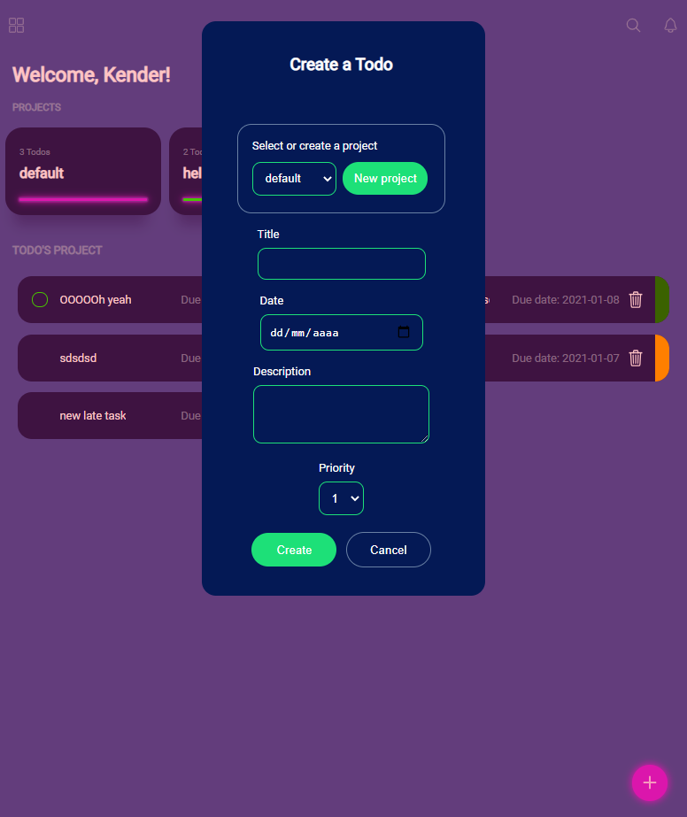

# TO-DO list using javaScript

>   I base this project on the practice for DOM manipulation with JavaScript, Webpack and working with OOP. This project is an app to create To-dos and manage your tasks with colors and priorities. You can include your to-dos on different projects, edit its details and delete the to-do if you completed it.

## Built With

- Webpack
- VS Code
- JavaScript
- SASS.

## Demo Screenshots

## Live Demo

[Live version](https://rawcdn.githack.com/kenderb/WEATHER-APP/f217fc3e6ff8af21fed885f5a847d1ba291815bf/dist/index.html)

## Prerequisites

node: v12.19.0
## Getting Started
To get a local copy up and running follow these simple example steps.

- Open a terminal or command prompt interface on your PC.
- Clone the repo with: `git clone https://github.com/kenderb/TODO-LIST-JS.git`
- On the terminal navigate to the project directory using `cd TODO-LIST-JS/`

## 📝 Setup

1. On the terminal navigate to the project directory using `cd TODO-LIST-JS/`.
2. Install dependencies using: `npm install`.
2. Run a server using: `npx webpack serve`.
3. Open `http://localhost:3000/` in your browser or open the index.html on your browser.

## Authors

👤 **Kender Bolivar**

- GitHub: [@kenderb](https://github.com/ken)
- Twitter: [@KBTarts](https://twitter.com/KBTarts )
- LinkedIn: [KenderBolivar](https://www.linkedin.com/in/kender-bolivar-1736086b/ )

## 🤝 Contributing

Contributions, issues and feature requests are welcome!

Feel free to check the [issues page](https://github.com/kenderb/TODO-LIST-JS/issues).

## Show your support

Give a ⭐️ if you like this project!

## :grey_exclamation: Acknowledgments

- Stack Overflow
- Odin Project.

## 📝 License

[MIT LICENSE](LICENSE)
